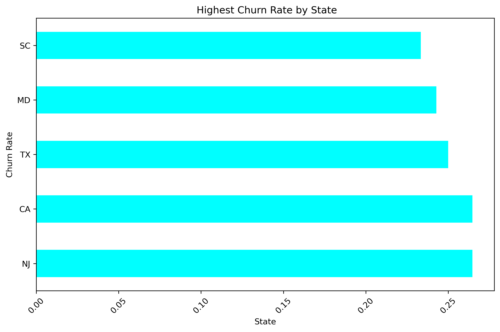

# *KEEPING CUSTOMERS CONNECTED - AND NOT DISCONNECTED!*

## 📋 Project Overview

This repository contains a comprehensive data analysis project with detailed exploratory data analysis, visualizations, and insights.

## 📁 Project Structure

```
SyriaTel/
├── anaconda_projects
│   └── db
│       └── project_filebrowser.db
├── Data report.pdf
├── Group 1 SyriaTel Presentation.pdf
├── README.md
├── Syria_Tel.csv
├── comparison.png
├── confusion matrix.png
├── feature_importance.png
├── generate_readme.py
├── highestchurn_states.png
├── index .ipynb
└── telecomm.webp

```

## 📄 File Descriptions

### 📓 Notebooks
- `index .ipynb`: Main analysis notebook containing data exploration, visualization, and modeling

### 📊 Data Files
- `Group 1 SyriaTel Presentation.pdf`: Report or documentation in PDF format
- `Data report.pdf`: Report or documentation in PDF format
- `Syria_Tel.csv`: CSV dataset used for analysis

### 🖼️ Visualizations
- `highestchurn_states.png`: Generated visualization/chart
- `confusion matrix.png`: Generated visualization/chart
- `comparison.png`: Generated visualization/chart
- `feature_importance.png`: Generated visualization/chart

### 📋 Other Files
- `telecomm.webp`: Additional project file
- `README.md`: Additional project file
- `.ipynb_checkpoints`: Additional project file
- `generate_readme.py`: Python script
- `anaconda_projects`: Additional project file

## 🔍 Analysis Sections

## *KEEPING CUSTOMERS CONNECTED - AND NOT DISCONNECTED!*

## 1.BUSINESS UNDERSTANDING

## 3. DATA EXPLORATION

Loading and initial inspection of the dataset.

### 3.1 Loading a dataset

Loading and initial inspection of the dataset.

### 3.2 Data cleaning

Loading and initial inspection of the dataset.

## 4. EXPLANATORY DATA ANALYSIS

Loading and initial inspection of the dataset.

### 4.1 Churn by customer service calls

### 4.2 hurn rate by state

### 4.3 Feature Importance

Setting up the required libraries and dependencies for the analysis.

## 5. MODELLING

Machine learning model development and evaluation.

### 5.1 BASELINE MODEL

Machine learning model development and evaluation.

#### 5.1.1 LOGISTIC REGRESSION

### 5.2 LOGISTIC REGRESSION WITH ALL FEATURES.

### 5.3 DECISIONTREE CLASSIFIER

### 5.3 RANDOM FOREST MODEL

Machine learning model development and evaluation.

## 6.EVALUATION

### 6.1 Logistic regression baseline model

Machine learning model development and evaluation.

### 6.2 Logistic regression  model with all features

Machine learning model development and evaluation.

### 6.3 DecisionTreeClassifier with all features

### 6.4 Random forest with all features

### HOW FEATURES INFLUENCING CHURN

## 7.CONCLUSION

Summary of findings and conclusions.

## 8. RECCOMENDATIONS


## 🎯 Key Findings

<!-- Add your key findings here based on the analysis results -->

- Finding 1: [Describe your main finding]

- Finding 2: [Describe another key insight]

- Finding 3: [Add more findings as needed]


## 📈 Visualizations

### Highestchurn States



### Confusion Matrix


### Comparison


### Feature Importance


## 🛠️ Technologies Used

- **Python**: Main programming language

- **Jupyter Notebook**: Interactive development environment

- **Pandas**: Data manipulation and analysis

- **NumPy**: Numerical computing

- **Matplotlib/Seaborn**: Data visualization

- **Scikit-learn**: Machine learning (if applicable)


## 🚀 How to Run

1. Clone this repository:

   ```bash

   git clone [your-repository-url]

   ```

2. Install required dependencies:

   ```bash

   pip install pandas numpy matplotlib seaborn jupyter scikit-learn

   ```

3. Launch Jupyter Notebook:

   ```bash

   jupyter notebook

   ```

4. Open and run `index .ipynb`


## 📋 Requirements

```

pandas>=1.3.0

numpy>=1.21.0

matplotlib>=3.4.0

seaborn>=0.11.0

jupyter>=1.0.0

scikit-learn>=1.0.0

```


## 👤 Author

[Your Name] - [Your Email]


