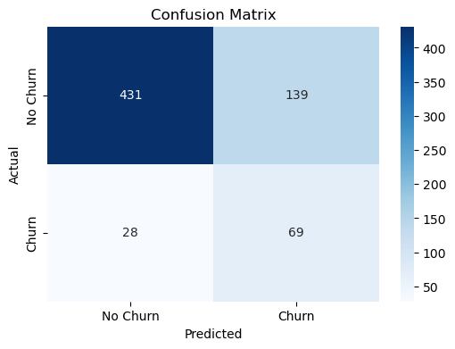

# *KEEPING CUSTOMERS CONNECTED - AND NOT DISCONNECTED!* 
 ## THE SYRIATEL ANALYSIS

# 1.BUSINESS UNDERSTANDING

## **1.1 BUSINESS OVERVIEW**

According to this [article](https://www.sciencedirect.com/topics/social-sciences/telecommunications-industry) published in 2011, Telecommunications company is an organization that provides services for long distance communication. They do this by building and mainatining  the physical networks, like cell towers, that transmit signals to individuals and businesses.These companies facilitate essential services like accessing the internet, making phone calls and sending messages. They make money through customer subscriptions and usage fees for these services.SyriaTel is a telecom company that provides call,text and data services to customers. 
One advantage of working with in the telecommunication sector is that it is a high-performing sector that contributes to economic growth, potentially increasing returns for investors. Telecommunication is also an essential service with steady demand, making it stable and a valuable industry to be part of.
However, the telecom industry is highly competitive and customers can easily switch to other providers if they're dissatisfied. This creates a high risk of customer churn, which can reduce revenue and can discourage investor confidence if not properly managed.


## **1.2 PROBLEM STATEMENT**
SyriaTel is losing customers to competitors, by analysing customer data, we can predict churn and uncover the reasons why customers leave, so SyriaTel can take action to reduce churn and improve customer retention.

This is costly because:

*Revenue loss:* Each customer lost means recurring revenue lost.

*High acquisition cost:* It is more expensive to acquire a new customer than to retain an exsisting one.

*Competitive pressure:* In a competetive market, reducing churn is critical for survival and growth.

If we can predict which customers are likely to leave, SyriaTel can take action early eg. giving offers, improving services,or solving problems to make those customers stay.

So the goal is to reduce churn and keep loyal customers.


## **1.3 BUSINESS OBJECTIVES**

 ## 1.3.1 *Main objective:*
To create a succesful binary classification model that predicts customers likelihood to churn.


 ## 1.3.2 *Specific objectives:*

1. To develop a model that predicts whether a customer will churn or stay.
2. To predict customer churn and provide insights that help SyriaTel keep its customers and reduce revenue loss.
3. To identify the key factors eg. call charges, service quality or customer complaints that influence the probability of a customer to churn or not to churn.
4. To provide insights that SyriaTel can use to design strategies for reducing churn and improving customer satisfaction.
5. To determine the state with the highest churning rate.


 ## 1.3.3*Research questions*
1. What is the best performing binary classification to use for prediction?
2. Can we accurately predict which syriaTel customers are likely to churn using their demographic and usage data?
3. What are the main factors that influence customer churn?
4. How can SyriaTel use the model's prediction and insights to design strategies that reduce churn and retain more customers?
5. What is the state with the highest churning rate?

## **1.4 SUCCESS CRITERIA**

 ***Model performance***
 
The churn prediction model achieves a good level of balance between recall and ROC-AUC score inorder to correctly identifying customers who churn.
 
 ***Insights gained***
 
The analysis clearly identifies the key factors that contribute to churn eg. high call charges and frequent complains.
 
 ***Business value***
 
SyriaTel can use the model's results to take practical actions, such as designing loyalty offers or improving customer service which can help improve customer churn.


# 2. DATA UNDERSTANDING
The Syria Tel customer churn dataset we are working with is from [Kaggle](https://www.kaggle.com/becksddf/churn-in-telecoms-dataset).Our data is on Syria Tel which is a telecommunication conmpany, it had a total of 21 columns and 3333 rows after data cleaning we decided to work with the coloumns below: where `churn` is our dependent varaible.
    
`state` – U.S. state where the customer lives.
    
`account length `– Number of days the customer has had the account.
    
`area code` – Telephone area code.
    
`phone number` – Customer’s phone number (serves as an identifier, not useful for prediction).
    
`international plan`– Whether the customer has an international calling plan (yes/no).
    
`log_vmail_messages` – Number of voicemail messages the customer has.
    
`customer service calls` – Number of calls made to customer service.
    
**`churn`** – Whether the customer left the company (True = churned, False = stayed). which is our dependent variable**
    
`total_calls` - The total number of calls.
    
`total_minutes` - The total number number of minutes for all calls.
    
`total_charge` - The total charges for all calls.

     
We are merging the columns `total day minutes` ,`total eve minutes` and `total night minutes` into one column named `total_minutes`. We are also merging `total day calls` , `total eve calls` and `total night calls` into one column named `total_calls`. The columns `total day charge`, `total eve charge`,  and`total night charge` are also being merged to become one column called `total_charge`.


# 3. DATA EXPLORATION

## 3.1 Loading a dataset


```python
import pandas as pd 
import numpy as np 
import matplotlib.pyplot as plt 
%matplotlib inline 
import seaborn as sns 
```


```python
df = pd.read_csv("Syria_Tel.csv")
df.head()
```


<div>
<style scoped>
    .dataframe tbody tr th:only-of-type {
        vertical-align: middle;
    }

    .dataframe tbody tr th {
        vertical-align: top;
    }

    .dataframe thead th {
        text-align: right;
    }
</style>
<table border="1" class="dataframe">
  <thead>
    <tr style="text-align: right;">
      <th></th>
      <th>state</th>
      <th>account length</th>
      <th>area code</th>
      <th>phone number</th>
      <th>international plan</th>
      <th>voice mail plan</th>
      <th>number vmail messages</th>
      <th>total day minutes</th>
      <th>total day calls</th>
      <th>total day charge</th>
      <th>...</th>
      <th>total eve calls</th>
      <th>total eve charge</th>
      <th>total night minutes</th>
      <th>total night calls</th>
      <th>total night charge</th>
      <th>total intl minutes</th>
      <th>total intl calls</th>
      <th>total intl charge</th>
      <th>customer service calls</th>
      <th>churn</th>
    </tr>
  </thead>
  <tbody>
    <tr>
      <th>0</th>
      <td>KS</td>
      <td>128</td>
      <td>415</td>
      <td>382-4657</td>
      <td>no</td>
      <td>yes</td>
      <td>25</td>
      <td>265.1</td>
      <td>110</td>
      <td>45.07</td>
      <td>...</td>
      <td>99</td>
      <td>16.78</td>
      <td>244.7</td>
      <td>91</td>
      <td>11.01</td>
      <td>10.0</td>
      <td>3</td>
      <td>2.70</td>
      <td>1</td>
      <td>False</td>
    </tr>
    <tr>
      <th>1</th>
      <td>OH</td>
      <td>107</td>
      <td>415</td>
      <td>371-7191</td>
      <td>no</td>
      <td>yes</td>
      <td>26</td>
      <td>161.6</td>
      <td>123</td>
      <td>27.47</td>
      <td>...</td>
      <td>103</td>
      <td>16.62</td>
      <td>254.4</td>
      <td>103</td>
      <td>11.45</td>
      <td>13.7</td>
      <td>3</td>
      <td>3.70</td>
      <td>1</td>
      <td>False</td>
    </tr>
    <tr>
      <th>2</th>
      <td>NJ</td>
      <td>137</td>
      <td>415</td>
      <td>358-1921</td>
      <td>no</td>
      <td>no</td>
      <td>0</td>
      <td>243.4</td>
      <td>114</td>
      <td>41.38</td>
      <td>...</td>
      <td>110</td>
      <td>10.30</td>
      <td>162.6</td>
      <td>104</td>
      <td>7.32</td>
      <td>12.2</td>
      <td>5</td>
      <td>3.29</td>
      <td>0</td>
      <td>False</td>
    </tr>
    <tr>
      <th>3</th>
      <td>OH</td>
      <td>84</td>
      <td>408</td>
      <td>375-9999</td>
      <td>yes</td>
      <td>no</td>
      <td>0</td>
      <td>299.4</td>
      <td>71</td>
      <td>50.90</td>
      <td>...</td>
      <td>88</td>
      <td>5.26</td>
      <td>196.9</td>
      <td>89</td>
      <td>8.86</td>
      <td>6.6</td>
      <td>7</td>
      <td>1.78</td>
      <td>2</td>
      <td>False</td>
    </tr>
    <tr>
      <th>4</th>
      <td>OK</td>
      <td>75</td>
      <td>415</td>
      <td>330-6626</td>
      <td>yes</td>
      <td>no</td>
      <td>0</td>
      <td>166.7</td>
      <td>113</td>
      <td>28.34</td>
      <td>...</td>
      <td>122</td>
      <td>12.61</td>
      <td>186.9</td>
      <td>121</td>
      <td>8.41</td>
      <td>10.1</td>
      <td>3</td>
      <td>2.73</td>
      <td>3</td>
      <td>False</td>
    </tr>
  </tbody>
</table>
<p>5 rows × 21 columns</p>
</div>


```python
df.shape
```


    (3333, 21)


Our dataset has *3333* rows and *21* columns .


```python
df.info()
```

    <class 'pandas.core.frame.DataFrame'>
    RangeIndex: 3333 entries, 0 to 3332
    Data columns (total 21 columns):
     #   Column                  Non-Null Count  Dtype  
    ---  ------                  --------------  -----  
     0   state                   3333 non-null   object 
     1   account length          3333 non-null   int64  
     2   area code               3333 non-null   int64  
     3   phone number            3333 non-null   object 
     4   international plan      3333 non-null   object 
     5   voice mail plan         3333 non-null   object 
     6   number vmail messages   3333 non-null   int64  
     7   total day minutes       3333 non-null   float64
     8   total day calls         3333 non-null   int64  
     9   total day charge        3333 non-null   float64
     10  total eve minutes       3333 non-null   float64
     11  total eve calls         3333 non-null   int64  
     12  total eve charge        3333 non-null   float64
     13  total night minutes     3333 non-null   float64
     14  total night calls       3333 non-null   int64  
     15  total night charge      3333 non-null   float64
     16  total intl minutes      3333 non-null   float64
     17  total intl calls        3333 non-null   int64  
     18  total intl charge       3333 non-null   float64
     19  customer service calls  3333 non-null   int64  
     20  churn                   3333 non-null   bool   
    dtypes: bool(1), float64(8), int64(8), object(4)
    memory usage: 524.2+ KB
    

## 3.2 Data cleaning

Let's check for any missing values in our dataset.


```python
df.isnull().sum()
```


    state                     0
    account length            0
    area code                 0
    phone number              0
    international plan        0
    voice mail plan           0
    number vmail messages     0
    total day minutes         0
    total day calls           0
    total day charge          0
    total eve minutes         0
    total eve calls           0
    total eve charge          0
    total night minutes       0
    total night calls         0
    total night charge        0
    total intl minutes        0
    total intl calls          0
    total intl charge         0
    customer service calls    0
    churn                     0
    dtype: int64


Since our dataset doesn't have any missing values we don't have to drop any null or fill for missing values.

Let's drop the `phone number` column since it is not useful in our prediction.


```python
#dropping a column
df = df.drop(columns =['phone number'])

```


```python
df.shape
```


    (3333, 20)


We need to check for categorical data in our dataset so that we can perform **one hot encoding** which is an important step for us to make predictions and create Machine learning models.


```python
#checking for categorical values
categorical_cols = df.select_dtypes(include=["object"]).columns
print(categorical_cols)

```

    Index(['state', 'international plan', 'voice mail plan'], dtype='object')
    

`state`, `international plan` and `voice mail plan` are the columns that are categorical and we need to perfom one hot encoding on 


```python
df["international plan"].value_counts()
```


    international plan
    no     3010
    yes     323
    Name: count, dtype: int64


```python
df["voice mail plan"].value_counts()
```


    voice mail plan
    no     2411
    yes     922
    Name: count, dtype: int64


```python
# One-hot encode both binary categorical columns
df_encoded = pd.get_dummies(df,columns=["international plan", "voice mail plan"],drop_first=True,dtype=int)
df_encoded.head()


```


<div>
<style scoped>
    .dataframe tbody tr th:only-of-type {
        vertical-align: middle;
    }

    .dataframe tbody tr th {
        vertical-align: top;
    }

    .dataframe thead th {
        text-align: right;
    }
</style>
<table border="1" class="dataframe">
  <thead>
    <tr style="text-align: right;">
      <th></th>
      <th>state</th>
      <th>account length</th>
      <th>area code</th>
      <th>number vmail messages</th>
      <th>total day minutes</th>
      <th>total day calls</th>
      <th>total day charge</th>
      <th>total eve minutes</th>
      <th>total eve calls</th>
      <th>total eve charge</th>
      <th>total night minutes</th>
      <th>total night calls</th>
      <th>total night charge</th>
      <th>total intl minutes</th>
      <th>total intl calls</th>
      <th>total intl charge</th>
      <th>customer service calls</th>
      <th>churn</th>
      <th>international plan_yes</th>
      <th>voice mail plan_yes</th>
    </tr>
  </thead>
  <tbody>
    <tr>
      <th>0</th>
      <td>KS</td>
      <td>128</td>
      <td>415</td>
      <td>25</td>
      <td>265.1</td>
      <td>110</td>
      <td>45.07</td>
      <td>197.4</td>
      <td>99</td>
      <td>16.78</td>
      <td>244.7</td>
      <td>91</td>
      <td>11.01</td>
      <td>10.0</td>
      <td>3</td>
      <td>2.70</td>
      <td>1</td>
      <td>False</td>
      <td>0</td>
      <td>1</td>
    </tr>
    <tr>
      <th>1</th>
      <td>OH</td>
      <td>107</td>
      <td>415</td>
      <td>26</td>
      <td>161.6</td>
      <td>123</td>
      <td>27.47</td>
      <td>195.5</td>
      <td>103</td>
      <td>16.62</td>
      <td>254.4</td>
      <td>103</td>
      <td>11.45</td>
      <td>13.7</td>
      <td>3</td>
      <td>3.70</td>
      <td>1</td>
      <td>False</td>
      <td>0</td>
      <td>1</td>
    </tr>
    <tr>
      <th>2</th>
      <td>NJ</td>
      <td>137</td>
      <td>415</td>
      <td>0</td>
      <td>243.4</td>
      <td>114</td>
      <td>41.38</td>
      <td>121.2</td>
      <td>110</td>
      <td>10.30</td>
      <td>162.6</td>
      <td>104</td>
      <td>7.32</td>
      <td>12.2</td>
      <td>5</td>
      <td>3.29</td>
      <td>0</td>
      <td>False</td>
      <td>0</td>
      <td>0</td>
    </tr>
    <tr>
      <th>3</th>
      <td>OH</td>
      <td>84</td>
      <td>408</td>
      <td>0</td>
      <td>299.4</td>
      <td>71</td>
      <td>50.90</td>
      <td>61.9</td>
      <td>88</td>
      <td>5.26</td>
      <td>196.9</td>
      <td>89</td>
      <td>8.86</td>
      <td>6.6</td>
      <td>7</td>
      <td>1.78</td>
      <td>2</td>
      <td>False</td>
      <td>1</td>
      <td>0</td>
    </tr>
    <tr>
      <th>4</th>
      <td>OK</td>
      <td>75</td>
      <td>415</td>
      <td>0</td>
      <td>166.7</td>
      <td>113</td>
      <td>28.34</td>
      <td>148.3</td>
      <td>122</td>
      <td>12.61</td>
      <td>186.9</td>
      <td>121</td>
      <td>8.41</td>
      <td>10.1</td>
      <td>3</td>
      <td>2.73</td>
      <td>3</td>
      <td>False</td>
      <td>1</td>
      <td>0</td>
    </tr>
  </tbody>
</table>
</div>


Encoding `state` into 50 dummy columns might not be the recommended way to go about it because it will make it harder for the model to interpret and cause **multicollinearity**, So for this `state` column we took a different approach.


```python
df_encoded["state"].value_counts().head(7)
```


    state
    WV    106
    MN     84
    NY     83
    AL     80
    WI     78
    OH     78
    OR     78
    Name: count, dtype: int64


```python
df_encoded["churn"].value_counts()
```


    churn
    False    2850
    True      483
    Name: count, dtype: int64


For uniformity i wanna change the contents of this columns to 0 and 1 to match the new encoded columns.


```python
#convert entries
df_encoded["churn"] = df_encoded["churn"].map({True: 1, False: 0})

```


```python
df_encoded["churn"].unique()
```


    array([0, 1], dtype=int64)


Let's check for class imbalance in our dependent variable `churn`


```python
df_encoded["churn"].value_counts(normalize = True)
```


    churn
    0    0.855086
    1    0.144914
    Name: proportion, dtype: float64


There is clearly a class imbalance on this column with **85.5%** of the data going to 0 (stay) while the other **14.49%** going to churn and this might not give a correct representation of our model prediction.

Let's check for feature distributions and decide whether to perform log transformation or other normalizations before modelling.


```python
df_encoded.describe()
```


<div>
<style scoped>
    .dataframe tbody tr th:only-of-type {
        vertical-align: middle;
    }

    .dataframe tbody tr th {
        vertical-align: top;
    }

    .dataframe thead th {
        text-align: right;
    }
</style>
<table border="1" class="dataframe">
  <thead>
    <tr style="text-align: right;">
      <th></th>
      <th>account length</th>
      <th>area code</th>
      <th>number vmail messages</th>
      <th>total day minutes</th>
      <th>total day calls</th>
      <th>total day charge</th>
      <th>total eve minutes</th>
      <th>total eve calls</th>
      <th>total eve charge</th>
      <th>total night minutes</th>
      <th>total night calls</th>
      <th>total night charge</th>
      <th>total intl minutes</th>
      <th>total intl calls</th>
      <th>total intl charge</th>
      <th>customer service calls</th>
      <th>churn</th>
      <th>international plan_yes</th>
      <th>voice mail plan_yes</th>
    </tr>
  </thead>
  <tbody>
    <tr>
      <th>count</th>
      <td>3333.000000</td>
      <td>3333.000000</td>
      <td>3333.000000</td>
      <td>3333.000000</td>
      <td>3333.000000</td>
      <td>3333.000000</td>
      <td>3333.000000</td>
      <td>3333.000000</td>
      <td>3333.000000</td>
      <td>3333.000000</td>
      <td>3333.000000</td>
      <td>3333.000000</td>
      <td>3333.000000</td>
      <td>3333.000000</td>
      <td>3333.000000</td>
      <td>3333.000000</td>
      <td>3333.000000</td>
      <td>3333.000000</td>
      <td>3333.000000</td>
    </tr>
    <tr>
      <th>mean</th>
      <td>101.064806</td>
      <td>437.182418</td>
      <td>8.099010</td>
      <td>179.775098</td>
      <td>100.435644</td>
      <td>30.562307</td>
      <td>200.980348</td>
      <td>100.114311</td>
      <td>17.083540</td>
      <td>200.872037</td>
      <td>100.107711</td>
      <td>9.039325</td>
      <td>10.237294</td>
      <td>4.479448</td>
      <td>2.764581</td>
      <td>1.562856</td>
      <td>0.144914</td>
      <td>0.096910</td>
      <td>0.276628</td>
    </tr>
    <tr>
      <th>std</th>
      <td>39.822106</td>
      <td>42.371290</td>
      <td>13.688365</td>
      <td>54.467389</td>
      <td>20.069084</td>
      <td>9.259435</td>
      <td>50.713844</td>
      <td>19.922625</td>
      <td>4.310668</td>
      <td>50.573847</td>
      <td>19.568609</td>
      <td>2.275873</td>
      <td>2.791840</td>
      <td>2.461214</td>
      <td>0.753773</td>
      <td>1.315491</td>
      <td>0.352067</td>
      <td>0.295879</td>
      <td>0.447398</td>
    </tr>
    <tr>
      <th>min</th>
      <td>1.000000</td>
      <td>408.000000</td>
      <td>0.000000</td>
      <td>0.000000</td>
      <td>0.000000</td>
      <td>0.000000</td>
      <td>0.000000</td>
      <td>0.000000</td>
      <td>0.000000</td>
      <td>23.200000</td>
      <td>33.000000</td>
      <td>1.040000</td>
      <td>0.000000</td>
      <td>0.000000</td>
      <td>0.000000</td>
      <td>0.000000</td>
      <td>0.000000</td>
      <td>0.000000</td>
      <td>0.000000</td>
    </tr>
    <tr>
      <th>25%</th>
      <td>74.000000</td>
      <td>408.000000</td>
      <td>0.000000</td>
      <td>143.700000</td>
      <td>87.000000</td>
      <td>24.430000</td>
      <td>166.600000</td>
      <td>87.000000</td>
      <td>14.160000</td>
      <td>167.000000</td>
      <td>87.000000</td>
      <td>7.520000</td>
      <td>8.500000</td>
      <td>3.000000</td>
      <td>2.300000</td>
      <td>1.000000</td>
      <td>0.000000</td>
      <td>0.000000</td>
      <td>0.000000</td>
    </tr>
    <tr>
      <th>50%</th>
      <td>101.000000</td>
      <td>415.000000</td>
      <td>0.000000</td>
      <td>179.400000</td>
      <td>101.000000</td>
      <td>30.500000</td>
      <td>201.400000</td>
      <td>100.000000</td>
      <td>17.120000</td>
      <td>201.200000</td>
      <td>100.000000</td>
      <td>9.050000</td>
      <td>10.300000</td>
      <td>4.000000</td>
      <td>2.780000</td>
      <td>1.000000</td>
      <td>0.000000</td>
      <td>0.000000</td>
      <td>0.000000</td>
    </tr>
    <tr>
      <th>75%</th>
      <td>127.000000</td>
      <td>510.000000</td>
      <td>20.000000</td>
      <td>216.400000</td>
      <td>114.000000</td>
      <td>36.790000</td>
      <td>235.300000</td>
      <td>114.000000</td>
      <td>20.000000</td>
      <td>235.300000</td>
      <td>113.000000</td>
      <td>10.590000</td>
      <td>12.100000</td>
      <td>6.000000</td>
      <td>3.270000</td>
      <td>2.000000</td>
      <td>0.000000</td>
      <td>0.000000</td>
      <td>1.000000</td>
    </tr>
    <tr>
      <th>max</th>
      <td>243.000000</td>
      <td>510.000000</td>
      <td>51.000000</td>
      <td>350.800000</td>
      <td>165.000000</td>
      <td>59.640000</td>
      <td>363.700000</td>
      <td>170.000000</td>
      <td>30.910000</td>
      <td>395.000000</td>
      <td>175.000000</td>
      <td>17.770000</td>
      <td>20.000000</td>
      <td>20.000000</td>
      <td>5.400000</td>
      <td>9.000000</td>
      <td>1.000000</td>
      <td>1.000000</td>
      <td>1.000000</td>
    </tr>
  </tbody>
</table>
</div>


Every other column seems to have a n even distribution or little to know skewness.But let's take a look at `number vmail messages` whose most customers have 0 messages but some have upto 51 messages.


```python
sns.histplot(df_encoded["number vmail messages"], kde=True, bins=30)
plt.title("Distribution of Total Day Minutes")
plt.show()
```


    

    


```python
df_encoded["log_vmail_messages"] = np.log1p(df_encoded["number vmail messages"])
```


```python
sns.histplot(df_encoded["log_vmail_messages"], kde=True, bins=30)
plt.title("Log-Transformed Distribution")
plt.show()
```


    

    


 # 3.4 Feature engineering

Let's check how different columns correlate with each other before we decide on what features to use so we need to conduct feature engineering on the columns.


```python
#let's check for multicollinearity
corr = df_encoded.corr(numeric_only = True)
```


```python
plt.figure(figsize=(12,8))
sns.heatmap(corr, annot=True, fmt=".2f", cmap="RdBu_r", center=0, cbar=True)
plt.title("Correlation Heatmap of All Numeric Features",fontsize = 14)
plt.show()

```


    

    


Some of this features are highly correlated and give the same insights for example `total day minutes`,`total eve minutes`and `total night minutes` can be put together to give us `total_minutes` that are used in a 24hrs.This will be similarly be applied to `total_calls` and `total_charge`.


```python
df_encoded["total_minutes"] = df_encoded["total day minutes"] + df_encoded["total eve minutes"] + df_encoded["total night minutes"]
df_encoded["total_calls"] = df_encoded["total day calls"] + df_encoded["total eve calls"] + df_encoded["total night calls"] 
df_encoded["total_charge"] = df_encoded["total day charge"] + df_encoded["total eve charge"] + df_encoded["total night charge"] 


```


```python
cols_to_drop =["total day minutes", "total eve minutes", "total night minutes", "total day calls", "total eve calls", "total night calls",
    "total day charge", "total eve charge", "total night charge"]
```


```python
df_encoded = df_encoded.drop(columns = cols_to_drop)
```

Since `voice mail plan_yes` and `number vmails messages` carry essentially the same info and have a high correlation of **0.96**.Let's drop the column `voive mail plan_yes` because one can't sent or recieve any voice mails without a plan.


```python
df_encoded = df_encoded.drop(columns = ["voice mail plan_yes"])
```


```python
#cleaned dataframe
df_encoded.head()
```


<div>
<style scoped>
    .dataframe tbody tr th:only-of-type {
        vertical-align: middle;
    }

    .dataframe tbody tr th {
        vertical-align: top;
    }

    .dataframe thead th {
        text-align: right;
    }
</style>
<table border="1" class="dataframe">
  <thead>
    <tr style="text-align: right;">
      <th></th>
      <th>state</th>
      <th>account length</th>
      <th>area code</th>
      <th>number vmail messages</th>
      <th>total intl minutes</th>
      <th>total intl calls</th>
      <th>total intl charge</th>
      <th>customer service calls</th>
      <th>churn</th>
      <th>international plan_yes</th>
      <th>log_vmail_messages</th>
      <th>total_minutes</th>
      <th>total_calls</th>
      <th>total_charge</th>
    </tr>
  </thead>
  <tbody>
    <tr>
      <th>0</th>
      <td>KS</td>
      <td>128</td>
      <td>415</td>
      <td>25</td>
      <td>10.0</td>
      <td>3</td>
      <td>2.70</td>
      <td>1</td>
      <td>0</td>
      <td>0</td>
      <td>3.258097</td>
      <td>707.2</td>
      <td>300</td>
      <td>72.86</td>
    </tr>
    <tr>
      <th>1</th>
      <td>OH</td>
      <td>107</td>
      <td>415</td>
      <td>26</td>
      <td>13.7</td>
      <td>3</td>
      <td>3.70</td>
      <td>1</td>
      <td>0</td>
      <td>0</td>
      <td>3.295837</td>
      <td>611.5</td>
      <td>329</td>
      <td>55.54</td>
    </tr>
    <tr>
      <th>2</th>
      <td>NJ</td>
      <td>137</td>
      <td>415</td>
      <td>0</td>
      <td>12.2</td>
      <td>5</td>
      <td>3.29</td>
      <td>0</td>
      <td>0</td>
      <td>0</td>
      <td>0.000000</td>
      <td>527.2</td>
      <td>328</td>
      <td>59.00</td>
    </tr>
    <tr>
      <th>3</th>
      <td>OH</td>
      <td>84</td>
      <td>408</td>
      <td>0</td>
      <td>6.6</td>
      <td>7</td>
      <td>1.78</td>
      <td>2</td>
      <td>0</td>
      <td>1</td>
      <td>0.000000</td>
      <td>558.2</td>
      <td>248</td>
      <td>65.02</td>
    </tr>
    <tr>
      <th>4</th>
      <td>OK</td>
      <td>75</td>
      <td>415</td>
      <td>0</td>
      <td>10.1</td>
      <td>3</td>
      <td>2.73</td>
      <td>3</td>
      <td>0</td>
      <td>1</td>
      <td>0.000000</td>
      <td>501.9</td>
      <td>356</td>
      <td>49.36</td>
    </tr>
  </tbody>
</table>
</div>


# 4. EXPLANATORY DATA ANALYSIS

Let's do a bit of explanatory data analysis before we move to building our models.

## 4.1 Top 5 and Bottom 5 states with highest churn rate.


```python
# Group by state and churn counts
state_churn = df_encoded.groupby(["state", "churn"]).size().unstack(fill_value=0)

# Add churn rate per state
state_churn["churn_rate"] = state_churn[1] / (state_churn[0] + state_churn[1])

# Sort by churn rate (descending)
highest_churn = state_churn.sort_values(by="churn_rate", ascending=False).head(5)

least_churn = state_churn.sort_values(by ="churn_rate", ascending=False).tail(5)

print("Top 5 states with the highest churn rate:")
print(highest_churn)# show top 10 states with highest churn rate
print("Top 5 states with the least churn rate:")
print(least_churn)

```

    Top 5 states with the highest churn rate:
    churn   0   1  churn_rate
    state                    
    NJ     50  18    0.264706
    CA     25   9    0.264706
    TX     54  18    0.250000
    MD     53  17    0.242857
    SC     46  14    0.233333
    Top 5 states with the least churn rate:
    churn   0  1  churn_rate
    state                   
    IA     41  3    0.068182
    VA     72  5    0.064935
    AZ     60  4    0.062500
    AK     49  3    0.057692
    HI     50  3    0.056604
    


```python
plt.figure(figsize=(10,6))
highest_churn["churn_rate"].plot(kind="barh", color="cyan")
plt.title(" Highest Churn Rate by State")
plt.ylabel("Churn Rate")
plt.xlabel("State")
plt.xticks(rotation=45)
plt.show()

```


    

    


**New Jersey (NJ)**: Out of 68 customers, 18 churned giving a 26.5% churn rate.

**California (CA)**: Out of 34 customers, 9 churned giving a 26.5% churn rate.

**Texas (TX)**: Out of 72 customers, 18 churned this is a 25% churn rate.

**Maryland (MD)**: Out of 70 customers, 17 churned which is a 24.3% churn rate.

**South Carolina (SC)**: Out of 60 customers, 14 churned equal to 23.3% churn rate.

This might be due to reasons such as high competition, customer expectations among others.


```python
plt.figure(figsize=(10,6))
least_churn["churn_rate"].plot(kind="barh", color="pink")
plt.title(" Least Churn Rate by State")
plt.ylabel("Churn Rate")
plt.xlabel("State")
plt.xticks(rotation=45)
plt.show()
```


    

    


**Hawaii (HI)**: Out of 53 customers, only 3 churned equal to 5.7% churn rate.

**Alaska (AK)**: Out of 52 customers, 3 churned which is  5.8% churn rate.

**Arizona (AZ)**: Out of 64 customers, 4 churned adds upto 6.3% churn rate.

**Virginia (VA)**: Out of 77 customers, 5 churned equals to 6.5% churn rate.

**Iowa (IA)**: Out of 44 customers, 3 churned equals to 6.8% churn rate.

This will guide the company to know where it's loyal customers are and where they have a stronger market.

# 5. MODELLING

## 5.1 BASELINE MODEL

### 5.1.1 LOGISTIC REGRESSION

Let's move to creating models,specifically a logistic regression model because the problem we are trying to answer is a binary classification and we are also trying to answer the question **what is the probability of a customer to churn or not to churn?** depending on various features.

Before moving to the modelling bit of things we first have to do **feature selection** and also look at our predictor variable `churn`, So as to create our baseline model.


```python
df_encoded['churn'].value_counts(normalize =True)*100
```


    churn
    0    85.508551
    1    14.491449
    Name: proportion, dtype: float64


```python
sns.countplot(x="churn", data=df_encoded,color ="tomato")
plt.show()
```


    

    


As you can see from the above visual,the target variable is highly imbalanced.The class 0 has a percentage of **85.5%** while our class 1 has **14.49%** .It shows that 85% of the customers stayed while 14.49% churned which we must address during model training to avoid biased predictions.

Since `churn` is binary we can compute **Pearson correlation** between churn and other features before doing Logistic regression. 


```python
# Only keep numeric columns
numeric_df = df_encoded.select_dtypes(include=[np.number])

# Correlation with churn
churn_corr = numeric_df.corr()["churn"].sort_values(ascending=False)
print(churn_corr)

```

    churn                     1.000000
    international plan_yes    0.259852
    total_charge              0.226962
    customer service calls    0.208750
    total_minutes             0.196457
    total intl charge         0.068259
    total intl minutes        0.068239
    total_calls               0.019651
    account length            0.016541
    area code                 0.006174
    total intl calls         -0.052844
    number vmail messages    -0.089728
    log_vmail_messages       -0.098991
    Name: churn, dtype: float64
    

Let's visualize this correlation to `churn` column which is our dependent feature.


```python
#convert to Dataframe for heatmap
churn_corr_df = churn_corr.to_frame()
#plot heatmap
plt.figure(figsize=(6,10))
sns.heatmap(churn_corr_df, annot=True, cmap="coolwarm", center=0, cbar=True)
plt.title("Correlation of Features with Churn", fontsize=14)
plt.show()
```


    

    


We will be using Positive correlation features because they tell us who is likely to churn while Negaative correlation features tell us who is likely to stay.


```python
#sklearn model import required libraries
from sklearn.linear_model import LogisticRegression
from sklearn.model_selection import train_test_split
from sklearn.metrics import accuracy_score, precision_score, recall_score, f1_score, roc_auc_score, confusion_matrix, classification_report,roc_curve
```


```python
#top 4 positive correlatrion with churn
selected_features =["international plan_yes","total_charge" ,"customer service calls" ,"total_minutes"]           
```


```python
#independent and dependent variables
X = df_encoded[["international plan_yes","total_charge","customer service calls" ,"total_minutes"]]          
y = df_encoded["churn"]
```


```python
# train and test split
X_train, X_test, y_train, y_test = train_test_split( X, y, test_size=0.2, random_state=42, stratify=y) #stratify=y ensures the churn ration is preserved in both train and test
log_reg = LogisticRegression(max_iter=1000, class_weight="balanced", random_state=42)
#fit the model
log_reg.fit(X_train, y_train)
#let's predict
y_pred_base = log_reg.predict(X_test)
y_proba_base = log_reg.predict_proba(X_test)[:, 1]  # probability of churn (class 1)

```

## 5.2 LOGISTIC REGRESSION WITH ALL FEATURES.

We want to check whether adding more information improves the model compared to the baseline.For features we are using all the predictores available in the dataset excluding the target variable. We'll first onehotencode the multi-categorical variable state to have a smooth flow.


```python
from sklearn.model_selection import train_test_split
from sklearn.preprocessing import OneHotEncoder, StandardScaler
from sklearn.compose import ColumnTransformer
from sklearn.pipeline import Pipeline
from sklearn.linear_model import LogisticRegression
from sklearn.metrics import classification_report, roc_auc_score

```

Let's split and train our model.


```python
# Separate features and target
X = df_encoded.drop("churn", axis=1)
y = df_encoded["churn"]

# Split
X_train, X_test, y_train, y_test = train_test_split( X, y, test_size=0.2, random_state=42, stratify=y)

```

We will have to **OneHotEncode** our multi-categorical variable after conducting a split so that it ensures encoding happens after splitting, with no leakage.


```python
#encode state 
encoder = OneHotEncoder(handle_unknown="ignore", sparse_output=False)

# Fit on train, transform both train & test
X_train_state = encoder.fit_transform(X_train[["state"]])
X_test_state = encoder.transform(X_test[["state"]])
```

Now scale the the numeric features after encoding `state`


```python
# all numeric features
numeric_features = ['account length', 'area code', 'number vmail messages',
       'total intl minutes', 'total intl calls', 'total intl charge','log_vmail_messages',
       'customer service calls', 'international plan_yes','total_minutes',
       'total_calls', 'total_charge']
```


```python
scaler = StandardScaler()
X_train_num = scaler.fit_transform(X_train[numeric_features])
X_test_num = scaler.transform(X_test[numeric_features])
```


```python
#combine encoded vs numeric 
X_train_final = np.hstack([X_train_state, X_train_num])
X_test_final = np.hstack([X_test_state, X_test_num])

#fit the model
model = LogisticRegression(max_iter=1000, random_state=42,class_weight="balanced")
model.fit(X_train_final, y_train)

y_pred_log = model.predict(X_test_final)
y_proba_log = model.predict_proba(X_test_final)[:,1]
```

## 5.3 DECISIONTREE CLASSIFIER

Let's build another model to perform classification ,in this case a DecisionTree Classifier .


```python
from sklearn.preprocessing import OrdinalEncoder
enc = OrdinalEncoder()
df_encoded["state_encoded"] = enc.fit_transform(df_encoded[["state"]])

```


```python
df_encoded = df_encoded.drop(["state"],axis=1)
df_encoded.head()
```


<div>
<style scoped>
    .dataframe tbody tr th:only-of-type {
        vertical-align: middle;
    }

    .dataframe tbody tr th {
        vertical-align: top;
    }

    .dataframe thead th {
        text-align: right;
    }
</style>
<table border="1" class="dataframe">
  <thead>
    <tr style="text-align: right;">
      <th></th>
      <th>account length</th>
      <th>area code</th>
      <th>number vmail messages</th>
      <th>total intl minutes</th>
      <th>total intl calls</th>
      <th>total intl charge</th>
      <th>customer service calls</th>
      <th>churn</th>
      <th>international plan_yes</th>
      <th>log_vmail_messages</th>
      <th>total_minutes</th>
      <th>total_calls</th>
      <th>total_charge</th>
      <th>state_encoded</th>
    </tr>
  </thead>
  <tbody>
    <tr>
      <th>0</th>
      <td>128</td>
      <td>415</td>
      <td>25</td>
      <td>10.0</td>
      <td>3</td>
      <td>2.70</td>
      <td>1</td>
      <td>0</td>
      <td>0</td>
      <td>3.258097</td>
      <td>707.2</td>
      <td>300</td>
      <td>72.86</td>
      <td>16.0</td>
    </tr>
    <tr>
      <th>1</th>
      <td>107</td>
      <td>415</td>
      <td>26</td>
      <td>13.7</td>
      <td>3</td>
      <td>3.70</td>
      <td>1</td>
      <td>0</td>
      <td>0</td>
      <td>3.295837</td>
      <td>611.5</td>
      <td>329</td>
      <td>55.54</td>
      <td>35.0</td>
    </tr>
    <tr>
      <th>2</th>
      <td>137</td>
      <td>415</td>
      <td>0</td>
      <td>12.2</td>
      <td>5</td>
      <td>3.29</td>
      <td>0</td>
      <td>0</td>
      <td>0</td>
      <td>0.000000</td>
      <td>527.2</td>
      <td>328</td>
      <td>59.00</td>
      <td>31.0</td>
    </tr>
    <tr>
      <th>3</th>
      <td>84</td>
      <td>408</td>
      <td>0</td>
      <td>6.6</td>
      <td>7</td>
      <td>1.78</td>
      <td>2</td>
      <td>0</td>
      <td>1</td>
      <td>0.000000</td>
      <td>558.2</td>
      <td>248</td>
      <td>65.02</td>
      <td>35.0</td>
    </tr>
    <tr>
      <th>4</th>
      <td>75</td>
      <td>415</td>
      <td>0</td>
      <td>10.1</td>
      <td>3</td>
      <td>2.73</td>
      <td>3</td>
      <td>0</td>
      <td>1</td>
      <td>0.000000</td>
      <td>501.9</td>
      <td>356</td>
      <td>49.36</td>
      <td>36.0</td>
    </tr>
  </tbody>
</table>
</div>


```python
X = df_encoded.drop(columns=["churn"])
y = df_encoded['churn']

X_train, X_test, y_train, y_test = train_test_split(X, y, test_size=0.3, random_state=42, stratify=y)
```


```python
from sklearn.tree import DecisionTreeClassifier
from sklearn.model_selection import GridSearchCV

# Initialize the model
dt_temp = DecisionTreeClassifier(random_state=42, class_weight="balanced")
path = dt_temp.cost_complexity_pruning_path(X_train, y_train)
ccp_alphas = path.ccp_alphas
```


```python
# parameter grid
param_grid = {
    "max_depth": [3, 5, 7, 10,],
    "min_samples_split": [2, 5, 10],
    "min_samples_leaf": [1, 2, 4],
    "criterion": ["gini", "entropy"],
    "ccp_alpha": ccp_alphas 
}
dt = DecisionTreeClassifier(random_state=42,class_weight ="balanced")
#GridSearchCV will try different tree depths, splits, and leaf sizes, then pick the best configuration.
grid_search = GridSearchCV(estimator=dt,param_grid=param_grid,cv=5,scoring="recall",n_jobs=-1)

# Run grid search on training set
grid_search.fit(X_train, y_train)

# Best parameters
print("Best Parameters:", grid_search.best_params_)

# Evaluate on test set
y_pred_dt = grid_search.predict(X_test)
y_proba_dt = grid_search.predict_proba(X_test)[:, 1]
```

    Best Parameters: {'ccp_alpha': 0.0822770800193284, 'criterion': 'entropy', 'max_depth': 3, 'min_samples_leaf': 1, 'min_samples_split': 2}
    

## 5.3 RANDOM FOREST MODEL 

we will advance to use Random forest model to build another model.


```python
from sklearn.ensemble import RandomForestClassifier
```


```python
# churn = target variable

X = df_encoded.drop("churn", axis=1)
y = df_encoded["churn"]

# Train-test split
X_train, X_test, y_train, y_test = train_test_split(X, y, test_size=0.3, random_state=42, stratify=y)

```


```python
rf = RandomForestClassifier(random_state=42, class_weight="balanced")
#
param_grid = {
    "n_estimators": [100, 200],
    "max_depth": [5, 10, None],
    "min_samples_split": [2, 5],
    "min_samples_leaf": [1, 2]
}
grid_search = GridSearchCV(
    estimator=rf,
    param_grid=param_grid,
    scoring="recall",   # optimize for recall
    cv=5,
    n_jobs=-1,
    refit=True          # refits the best model on the whole training set
)
#fit grid search
grid_search.fit(X_train, y_train)

best_rf = grid_search.best_estimator_
print("Best Parameters:", grid_search.best_params_)
```

    Best Parameters: {'max_depth': 5, 'min_samples_leaf': 2, 'min_samples_split': 2, 'n_estimators': 200}
    


```python
y_pred_rf = best_rf.predict(X_test)
y_proba_rf = best_rf.predict_proba(X_test)[:, 1]

```

# 6.EVALUATION

In this section we will be evaluating our models to determine which performs better at predicting churning customers. We will compare the models and ultimately choose the one that performs better as our baseline model of recommendation.Let's begin.

We will be using Recall and ROC-AUC as the metric of success of our model.we will be using:

**Recall** 
*  Recall measures how many actual churners the model correctly identifies.
*  In churn prediction, missing a churner is costly, because it means losing a customer and revenue.
*  By optimizing high recall, we ensure the model captures most at-risk customers, even if it occasionally flags a few non-churners.

**ROC-AUC**
* measures the model’s ability to discriminate between churners and non-churners across all thresholds.
* ROC-AUC is threshold-independent, so it evaluates the model’s overall ranking ability.
* A high ROC-AUC means the model is reliable in assigning higher churn probabilities to churners than to non-churners, which is critical for making informed business decisions.

Togther they align with our business objectives and the problem we are tyrying to solve.

## 6.1 Logistic regression baseline model

We start with our basemodel logistic with 4 features


```python
y_train_pred = log_reg.predict(X_train)
y_train_proba = log_reg.predict_proba(X_train)[:, 1]

# Test predictions
y_test_pred = log_reg.predict(X_test)
y_test_proba = log_reg.predict_proba(X_test)[:, 1]

# Compute metrics
print("Train Accuracy:", accuracy_score(y_train, y_train_pred))
print("Test Accuracy:", accuracy_score(y_test, y_test_pred))
print("Train ROC-AUC:", roc_auc_score(y_train, y_train_proba))
print("Test ROC-AUC:", roc_auc_score(y_test, y_test_proba))
```

    Train Accuracy: 0.7700675168792198
    Test Accuracy: 0.7616191904047976
    Train ROC-AUC: 0.815667893827834
    Test ROC-AUC: 0.8076143968167843
    

Our logistic regression with 4 features does not show strong signs of overfitting. The performance is slightly better on the training set but performs close enough to the test set data suggesting good generalization.


```python
print("Accuracy:", accuracy_score(y_test, y_pred))
print("Precision:", precision_score(y_test, y_pred))
print("Recall:", recall_score(y_test, y_pred))
print("F1 Score:", f1_score(y_test, y_pred))
print("ROC-AUC:", roc_auc_score(y_test, y_proba))

print("\nClassification Report:\n", classification_report(y_test, y_pred))
```

**Accuracy score:**

We have an accuracy score of 76% which means about 76% of predictions are correct.But because the dataset is imbalanced accuracy alone is misleading.

**recall:**

The model correctly identifies 75% of true churners meaning the model is good at catching churners even though it misses about 25%.

**Precision :**

Out of all the customers predicted as churners, only 35% actually churn meaning it gives a high number of false positives.It therefore predicts churn when the customer stays.

This model is better at finding churners (high recall) than being precise about them (low precision).
This means:

We will catch most customers who are likely to churn,but also flag many who wouldn’t have churned (false alarms).


Let's visualize our ROC-AUC for more understanding of our model.


```python
# Compute ROC curve
fpr_base, tpr_base, thresholds = roc_curve(y_test, y_proba_base)

# Compute AUC
roc_auc_base = roc_auc_score(y_test, y_proba_base)

# Plot
plt.figure(figsize=(8,6))
plt.plot(fpr_base, tpr_base, label=f"ROC Curve (AUC = {roc_auc_base:.2f})", color="tomato")
plt.plot([0,1], [0,1], linestyle="--", color="black")  # Random baseline
plt.xlabel("False Positive Rate")
plt.ylabel("True Positive Rate (Recall)")
plt.title("ROC-AUC Curve for Churn Prediction Model")
plt.legend(loc="lower right")
plt.show()
```


    <Figure size 800x600 with 0 Axes>


    

    


Our ROC curve lies well above the diagonal, meaning the model does a good job distinguishing churners from non-churners.It has an AUC = 0.81 which is good and shows a that our model is highly predictive but has room for growth.


```python
#confusion matrix
cm = confusion_matrix(y_test, y_pred)
sns.heatmap(cm, annot=True, fmt="d", cmap="Greens",
            xticklabels=["Not Churn", "Churn"],
            yticklabels=["Not Churn", "Churn"])
plt.xlabel("Predicted")
plt.ylabel("Actual")
plt.show()
```


    

    


Top-left cell: customers correctly predicted as “stay”(True positive).

Bottom-right cell: customers correctly predicted as “churn”(True negative).

Top-right cell: customers predicted to churn but actually stayed (false positives).

Bottom-left cell: customers predicted to stay but actually churned (false negatives).

**7.1.2 Feature importance**


```python
feature_importance = pd.DataFrame({
    "Feature": X_train.columns,
    "Coefficient": log_reg.coef_[0]
}).sort_values(by="Coefficient", ascending=False)

print(feature_importance)
```

                      Feature  Coefficient
    0  international plan_yes     2.334522
    2  customer service calls     0.623310
    1            total_charge     0.079435
    3           total_minutes    -0.000756
    


```python
plt.figure(figsize=(8,5))

# Horizontal bar plot
sns.barplot(data =feature_importance,x="Coefficient",y="Feature")
plt.title("Feature Importance from Logistic Regression")
plt.xlabel("Coefficient Value (Impact on Churn)")
plt.ylabel("Features")
plt.show()

```


    

    


**Impact on churn**

Let's look at how the features of our baseline model affect churn.

`international plan_yes`(2.33): Customers with an international plan are much more likely to churn.

`customer service calls`(0.62): The more times a customer calls customer service, the higher the chance they churn.

`total_charge` (0.079): As charges increase, churn likelihood slightly increases.weak effect

`total_minutes`(-0.0007) :Customers who use more minutes are slightly less likely to churn

## 6.2 Logistic regression  model with all features

Let's first start by checking for **overfitting** in our model since we have used all features.


```python
# Train predictions
y_train_pred = model.predict(X_train_final)
y_train_prob = model.predict_proba(X_train_final)[:,1]

# Test predictions
y_test_pred = model.predict(X_test_final)
y_test_prob = model.predict_proba(X_test_final)[:,1]

print("Train Accuracy:", accuracy_score(y_train, y_train_pred))
print("Test Accuracy:", accuracy_score(y_test, y_test_pred))

print("Train ROC-AUC:", roc_auc_score(y_train, y_train_prob))
print("Test ROC-AUC:", roc_auc_score(y_test, y_test_prob))
```

    Train Accuracy: 0.7786946736684172
    Test Accuracy: 0.7496251874062968
    Train ROC-AUC: 0.8471525315880375
    Test ROC-AUC: 0.803906673901248
    

The model is slightly overfitting: it performs better on training data than unseen test data.It means it will give biased insights and can't be used to make business insights.

Let's take a look at the model's general performance.


```python
# Print metrics
print("Accuracy:", accuracy_score(y_test, y_pred))
print("Precision:", precision_score(y_test, y_pred))
print("Recall:", recall_score(y_test, y_pred))
print("F1-score:", f1_score(y_test, y_pred))
print("ROC-AUC:", roc_auc_score(y_test, y_pred_proba))

print("\nClassification Report:\n", classification_report(y_test, y_pred))
```

    Accuracy: 0.7496251874062968
    Precision: 0.3317307692307692
    Recall: 0.711340206185567
    F1-score: 0.4524590163934426
    ROC-AUC: 0.803906673901248
    
    Classification Report:
                   precision    recall  f1-score   support
    
               0       0.94      0.76      0.84       570
               1       0.33      0.71      0.45        97
    
        accuracy                           0.75       667
       macro avg       0.64      0.73      0.65       667
    weighted avg       0.85      0.75      0.78       667
    
    


```python
# Confusion matrix
cm = confusion_matrix(y_test, y_pred)

# Plot
plt.figure(figsize=(6,4))
sns.heatmap(cm, annot=True, fmt='d', cmap="Blues", xticklabels=["No Churn", "Churn"], yticklabels=["No Churn", "Churn"])
plt.xlabel("Predicted")
plt.ylabel("Actual")
plt.title("Confusion Matrix")
plt.show()
```


    

    


## 6.3 DecisionTreeClassifier with all features

Our Logistic regression model with all features did not improve.This might be because logistic regression may not fully capture nonlinear patterns in our data so we try a DecisionTreeClassifier.  

Overfitting was detected: The Random Forest captures patterns in the training data too closely, including noise, which reduces generalization. Large gap between train and test ROC-AUC shows from 0.991 to 0.896 which is prove for overfitting.After including a 'ccp_alpha': 0.0822770800193284 to our decision tree the model has improved and stopped Overfitting which show it's learning.


```python
# check for overfitting 
# Train predictions
y_train_pred = grid_search.predict(X_train)
y_train_prob = grid_search.predict_proba(X_train)[:,1]

# Test predictions
y_test_pred = grid_search.predict(X_test)
y_test_prob = grid_search.predict_proba(X_test)[:,1]

print("Train Accuracy:", accuracy_score(y_train, y_train_pred))
print("Test Accuracy:", accuracy_score(y_test, y_test_pred))

print("Train ROC-AUC:", roc_auc_score(y_train, y_train_prob))
print("Test ROC-AUC:", roc_auc_score(y_test, y_test_prob))
```

    Train Accuracy: 0.8752678954136305
    Test Accuracy: 0.855
    Train ROC-AUC: 0.8875346650650294
    Test ROC-AUC: 0.8664851784634
    


```python
print("Accuracy:", accuracy_score(y_test, y_pred_dt))
print("Precision:", precision_score(y_test, y_pred_dt))
print("Recall:", recall_score(y_test, y_pred_dt))
print("F1 Score:", f1_score(y_test, y_pred_dt))
print("ROC-AUC:",roc_auc_score(y_test, y_proba_dt))

print("\nClassification Report:\n", classification_report(y_test, y_pred_dt))
```

    Accuracy: 0.855
    Precision: 0.5
    Recall: 0.8344827586206897
    F1 Score: 0.6253229974160207
    ROC-AUC: 0.8664851784634
    
    Classification Report:
                   precision    recall  f1-score   support
    
               0       0.97      0.86      0.91       855
               1       0.50      0.83      0.63       145
    
        accuracy                           0.85      1000
       macro avg       0.73      0.85      0.77      1000
    weighted avg       0.90      0.85      0.87      1000
    
    


```python
# Plot ROC curve
#roc_auc = roc_auc_score(y_test, y_proba)
fpr_dt, tpr_dt, _ = roc_curve(y_test, y_proba_dt)
# Compute AUC score
roc_auc_tr = roc_auc_score(y_test, y_proba_dt)

plt.plot(fpr_dt, tpr_dt, label=f"Decision Tree (AUC = {roc_auc_tr:.2f})")
plt.plot([0,1],[0,1],'--',color='gray')
plt.xlabel("False Positive Rate")
plt.ylabel("True Positive Rate (Recall)")
plt.title("ROC-AUC Curve - Decision Tree")
plt.legend()
plt.show()
```


    

    


```python
y_pred = grid_search.predict(X_test)
# Confusion matrix
cm = confusion_matrix(y_test, y_pred)

# Plot heatmap
plt.figure(figsize=(6,4))
sns.heatmap(cm, annot=True, fmt='d', cmap="Blues",
            xticklabels=["No Churn", "Churn"],
            yticklabels=["No Churn", "Churn"])
plt.xlabel("Predicted")
plt.ylabel("Actual")
plt.title("Confusion Matrix - Decision Tree")
plt.show()
```


    

    


```python
from sklearn import tree
# Get the best estimator from grid search
best_dt = grid_search.best_estimator_

# Plot the tree
plt.figure(figsize=(20,10))
tree.plot_tree(
    best_dt, 
    feature_names=X_train.columns,    # Names of your features
    class_names=["No Churn", "Churn"],  # Target classes
    filled=True,                      # Color nodes by class
    rounded=True,                     # Rounded boxes
    fontsize=12
)
plt.title("Decision Tree from GridSearchCV")
plt.show()
```


    

    


The Decision Tree is performing much better across all metrics than the baseline logistic regression.

**Recall**: Slightly improved from 0.753 to 0.808 meaning the tree catches more actual churners.

**ROC-AUC**: Higher AUC of 0.90 means the tree has a much better ability to discriminate churners from non-churners overall

The Decision Tree clearly outperforms the baseline logistic regression on this dataset.


```python
# Feature importances
feat_importance = pd.DataFrame({
    "Feature": X_train.columns,
    "Importance": best_dt.feature_importances_
}).sort_values(by="Importance", ascending=False)

print(feat_importance)
```

                       Feature  Importance
    11            total_charge    0.396207
    7   international plan_yes    0.302360
    6   customer service calls    0.301433
    0           account length    0.000000
    1                area code    0.000000
    2    number vmail messages    0.000000
    3       total intl minutes    0.000000
    4         total intl calls    0.000000
    5        total intl charge    0.000000
    8       log_vmail_messages    0.000000
    9            total_minutes    0.000000
    10             total_calls    0.000000
    12           state_encoded    0.000000
    


```python
# Plot top features
plt.figure(figsize=(10,6))
plt.barh(feat_importance["Feature"], feat_importance["Importance"], color="hotpink")
plt.gca().invert_yaxis()  # largest on top
plt.xlabel("Importance")
plt.title("Feature Importance - Decision Tree")
plt.show()
```


    

    


**top 3 features** 

`total_charge` at a coefficient of (0.396) is strongest predictor of churn this can be intepreted as higher charges may indicate higher risk or dissatisfaction.

`customer service calls`(0.301) Number of calls to customer service strongly signals churn this might be a likelihood of more complaints.

`international plan_yes`(0.302) Having an international plan contributes significantly to predicting churn this might be perhaps because of cost concerns.

## 6.4 Random forest with all features

Let's take a look at how our Random Forest model worked compared to the others.


```python
# Metrics
print("Accuracy:", accuracy_score(y_test, y_pred_rf))
print("Precision:", precision_score(y_test, y_pred_rf))
print("Recall:", recall_score(y_test, y_pred_rf))
print("F1-score:", f1_score(y_test, y_pred_rf))
print("ROC-AUC:", roc_auc_score(y_test, y_proba_rf))

print("\nClassification Report:\n", classification_report(y_test, y_pred_rf))

```

    Accuracy: 0.963
    Precision: 0.9285714285714286
    Recall: 0.8068965517241379
    F1-score: 0.8634686346863468
    ROC-AUC: 0.9175720911474088
    
    Classification Report:
                   precision    recall  f1-score   support
    
               0       0.97      0.99      0.98       855
               1       0.93      0.81      0.86       145
    
        accuracy                           0.96      1000
       macro avg       0.95      0.90      0.92      1000
    weighted avg       0.96      0.96      0.96      1000
    
    

Random Forest outperforms both the baseline logistic regression and the Decision Tree in accuracy, precision, F1-score, and ROC-AUC.

**Recall** is the ability to detect actual churners and is slightly lower than the tuned Decision Tree (0.807 vs 0.814), but the precision and overall F1 improved significantly, meaning fewer false positives.

**ROC-AUC** Random Forest has the highest ROC-AUC (0.924), indicating it discriminates churners from non-churners better than the other models.

Random Forest gives the best overall performance on this dataset.


Tuning the probability threshold is the most common way to adjust the trade-off between precision and recall, especially in imbalanced datasets like churn prediction.we want to have a high recall which ensures we catch all churners but we will have to pay the price of false alarms which is a trade off we are willing to make.


```python
thresholds = np.arange(0.1, 1.0, 0.05)
for t in thresholds:
    y_pred_t = (y_proba_rf > t).astype(int)
    print(f"Threshold: {t:.2f} | Precision: {precision_score(y_test, y_pred_t):.2f} | Recall: {recall_score(y_test, y_pred_t):.2f} | F1: {f1_score(y_test, y_pred_t):.2f}")

```

    Threshold: 0.10 | Precision: 0.14 | Recall: 1.00 | F1: 0.25
    Threshold: 0.15 | Precision: 0.15 | Recall: 1.00 | F1: 0.26
    Threshold: 0.20 | Precision: 0.18 | Recall: 0.95 | F1: 0.30
    Threshold: 0.25 | Precision: 0.33 | Recall: 0.92 | F1: 0.48
    Threshold: 0.30 | Precision: 0.43 | Recall: 0.86 | F1: 0.57
    Threshold: 0.35 | Precision: 0.57 | Recall: 0.85 | F1: 0.68
    Threshold: 0.40 | Precision: 0.65 | Recall: 0.84 | F1: 0.73
    Threshold: 0.45 | Precision: 0.86 | Recall: 0.83 | F1: 0.84
    Threshold: 0.50 | Precision: 0.93 | Recall: 0.81 | F1: 0.86
    Threshold: 0.55 | Precision: 0.93 | Recall: 0.79 | F1: 0.85
    Threshold: 0.60 | Precision: 0.97 | Recall: 0.77 | F1: 0.85
    Threshold: 0.65 | Precision: 0.96 | Recall: 0.68 | F1: 0.79
    Threshold: 0.70 | Precision: 0.95 | Recall: 0.54 | F1: 0.69
    Threshold: 0.75 | Precision: 0.96 | Recall: 0.46 | F1: 0.62
    Threshold: 0.80 | Precision: 0.98 | Recall: 0.34 | F1: 0.51
    Threshold: 0.85 | Precision: 0.97 | Recall: 0.26 | F1: 0.40
    Threshold: 0.90 | Precision: 1.00 | Recall: 0.13 | F1: 0.23
    Threshold: 0.95 | Precision: 0.00 | Recall: 0.00 | F1: 0.00
    

    C:\Users\USER\anaconda3\Lib\site-packages\sklearn\metrics\_classification.py:1531: UndefinedMetricWarning: Precision is ill-defined and being set to 0.0 due to no predicted samples. Use `zero_division` parameter to control this behavior.
      _warn_prf(average, modifier, f"{metric.capitalize()} is", len(result))
    


```python
best_threshold = 0.35  # example from tuning
y_pred_final = (y_proba_rf > best_threshold).astype(int)

```


```python
# Metrics
print("Recall:", recall_score(y_test, y_pred_final))
print("ROC-AUC:", roc_auc_score(y_test, y_proba_rf))
```

    Recall: 0.8482758620689655
    ROC-AUC: 0.9175720911474088
    

Let's compare the models ROC-AUC and Recall across the models.

Our model correctly identifies 84.8% of the actual churners.A high recall will ensure we catch more churners and this important in churn prediction because missing churners (false negatives) can lead to lost revenue.ROC-AUC measures the model’s ability to discriminate between churners and non-churners across all possible thresholds. Our score of 0.917 indicates that if you randomly pick a churner and a non-churner, the model assigns a higher probability of churn to the churner 91.7% of the time.
We can conclude that This model is very good at separating churners from non-churners compared to our baseline model and other models too.

Let's visualize our random forest model ROC-AUC Curve.


```python
#plot ROC curve 
fpr_rf , tpr_rf , thresholds = roc_curve(y_test, y_proba_rf)
roc_auc_rf = roc_auc_score(y_test, y_proba_rf)
# Plot
plt.figure(figsize=(8,6))
plt.plot(fpr_rf ,tpr_rf, label =f"Random forest (AUC = {roc_auc_rf:.2f})",color = "orange")
plt.plot([0,1],[0,1],'--',color='cyan')
plt.xlabel("False Positive Rate")
plt.ylabel("True Positive Rate (Recall)")
plt.title(" Comparison ROC-AUC Curve")
plt.legend()
plt.show()
```


    

    


```python
y_pred = best_rf.predict(X_test)
# Confusion matrix
cm = confusion_matrix(y_test, y_pred)

# Plot heatmap
plt.figure(figsize=(6,4))
sns.heatmap(cm, annot=True, fmt='d', cmap="coolwarm",
            xticklabels=["No Churn", "Churn"],
            yticklabels=["No Churn", "Churn"])
plt.xlabel("Predicted")
plt.ylabel("Actual")
plt.title("Confusion Matrix - Random Forest")
plt.savefig("confusion matrix.png", dpi=300, bbox_inches='tight')
plt.show()
```


    

    


**Interpeted**

**True Negatives** (TN) = 846

Customers who did not churn and were correctly predicted as No Churn.

**False Positives**(FP) = 9

Customers who did not churn but were incorrectly predicted as Churn.

**False Negatives** (FN) = 28

Customers who churned but were incorrectly predicted as No Churn.

**True Positive** (TP) = 117

Customers who churned and were correctly predicted as Churn.


```python
# Feature importances
feat_importance = pd.DataFrame({
    "Feature": X_train.columns,
    "Importance": best_rf.feature_importances_  # from your fitted GridSearchCV best model
}).sort_values(by="Importance", ascending=False)
print(feat_importance)
```

                       Feature  Importance
    11            total_charge    0.305052
    6   customer service calls    0.195764
    9            total_minutes    0.142451
    7   international plan_yes    0.134658
    8       log_vmail_messages    0.039229
    2    number vmail messages    0.037308
    5        total intl charge    0.035482
    4         total intl calls    0.030410
    3       total intl minutes    0.026393
    10             total_calls    0.017660
    0           account length    0.016625
    12           state_encoded    0.015303
    1                area code    0.003666
    


```python
palette = sns.color_palette("viridis", len(feat_importance))
# Plot
plt.figure(figsize=(10,6))
plt.barh(feat_importance["Feature"], feat_importance["Importance"], color=palette)
plt.gca().invert_yaxis()
plt.xlabel("Importance")
plt.title("Random Forest Feature Importance")
plt.savefig("feature_importance.png", dpi=300, bbox_inches='tight')
plt.show()
```


    

    


## HOW FEATURES INFLUENCING CHURN
This are the features that increase rate of churning in the model we seek to deploy:

**total charge** Customers with higher total charges are more likely to churn.High spending may indicate dissatisfaction with value or plan costs.

**customer service calls** Frequent calls to customer service strongly predict churn. Likely reflects unresolved issues or poor service experience.

**total_minute** Customers with higher total minutes usage may be at risk; possibly they are testing services or comparing alternatives.

**international plan** Having an international plan increases churn risk. Possibly due to cost or underuse of the plan.

**area code** Area code does not influence churn prediction.

**state** Geographic location contributes very little.

## **NOTE :**

Based on our evaluation, the Random Forest model achieves the best balance of high recall (0.85) and ROC-AUC (0.92) with minimal overfitting, making it the most suitable model for deployment in predicting customer churn.

# 7.CONCLUSION
1. New Jersey (NJ) and California (CA) are the states with the highest churning rate at 26.5% churn rate.
2. Hawaii (HI) and Alaska (AK) have the most loyal customers with a low rate of 5.7% and 5.8%  churn rate respectively.
3. The best performing model has a recall of 84.5% and an ROC-AUC score of 91.7% .
4. High charges is the highest feature influencing churn at 0.305
5. Random Forest model is because it achieves the best balance of high recall (0.85) and ROC-AUC (0.92) with minimal overfitting.
6. Random forest model predicted a total of 963 out 1000 correctly .

# 8. RECCOMENDATIONS
1. Stakeholders should focus on states with highest churn NJ(New jersey) and CA(Carlifonia) with special offers, loyalty programs, or improved customer service inorder to retain the customers.
2. High charges, frequent customer service calls and international plans are the key factors driving churn. By targeting retention efforts to these customers, the company can maximize revenue retention.
3. Stakeholders should de-priotize  Voicemail usage, account length, state, and area code because they have minimal predictive value when working on interventions.
4. Stakeholders should investigate complaints or service issues in high-churn states to reduce dissatisfaction and also pay attention to areas that are reported by customer complaints to increase customer satisfaction .
5. Stakeholders should relocate resources to higher-risk states such as New Jersey, California ,Texas among others since churn is low in those states and replicate strategies used in those states to improve others.
